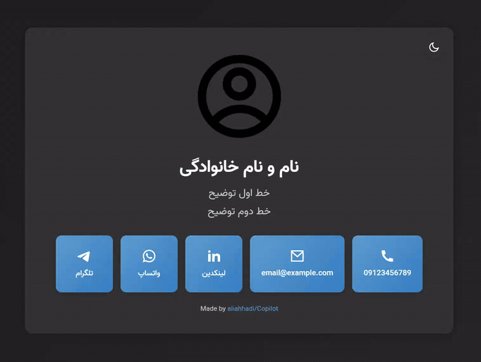

# قالب وب‌سایت پروفایل کسب‌وکار شخصی

## 🌐 پیش‌نمایش زنده (Live Demo)

برای مشاهده نمونه اجراشده این قالب، روی لینک زیر کلیک کنید:

🔗 **مشاهده وب‌سایت:** [https://aliashhadi.github.io/personal-profile-website/](https://aliashhadi.github.io/personal-profile-website/)

## 🖼️ پیش‌نمایش ظاهری

نمای کلی وب‌سایت در تصویر متحرک زیر قابل مشاهده است:

[](https://aliashhadi.github.io/personal-profile-website/)

> این GIF نمایی از طراحی، چیدمان ریسپانسیو و ظاهر کلی قالب را نشان می‌دهد.

---

## 🌙☀️ پشتیبانی از حالت تاریک و روشن (Dark / Light Mode)

این قالب به‌صورت پیش‌فرض با **حالت تاریک (Dark Mode)** اجرا می‌شود و دارای یک **دکمه سوییچ تغییر تم** در گوشه بالای سمت چپ صفحه است:

- 🌙 حالت تاریک برای استفاده در محیط‌های کم‌نور
- ☀️ حالت روشن برای خوانایی بهتر در نور روز
- تغییر تم به‌صورت آنی و بدون رفرش صفحه انجام می‌شود

---

این یک قالب وب‌سایت پروفایل کسب‌وکار شخصی تک‌صفحه‌ای قابل استفاده مجدد است که تنها با HTML5 و CSS3 ساخته شده. این قالب دارای طراحی مینیمال و مدرن با پشتیبانی RTL برای متن فارسی، چیدمان کاملاً ریسپانسیو و برندینگ یکپارچه است. عالی برای ایجاد چندین وب‌سایت شخصی‌سازی شده با جایگزین کردن داده‌های فردی به جای placeholderها.

## ویژگی‌ها

- **چیدمان RTL**: جهت متن راست به چپ برای محتوای فارسی با کدگذاری UTF-8.
- **طراحی ریسپانسیو**: رویکرد موبایل-اول با چیدمان‌های بهینه‌سازی شده برای همه اندازه‌های صفحه.
- **تم تاریک و روشن**: دارای دکمه سوییچ تغییر تم (Dark / Light Mode).
- **بهینه‌سازی موبایل**: دکمه‌های تماس انباشته شده با متن وسط‌چین و آیکون‌های راست‌چین در صفحه‌های کوچک.
- **دسترسی‌پذیری**: HTML معنایی، برچسب‌های ARIA، ناوبری صفحه‌کلید و کنتراست رنگ کافی.
- **عملکرد بالا**: CSS سبک با متغیرها، SVGهای درون‌خطی، JS مینیمال و بارگذاری سریع.
- **تایپوگرافی فارسی**: استفاده از فونت وزیر از CDN.
- **افکت‌های تعاملی**: هاور و ترنزیشن‌های نرم روی دکمه‌ها.

## ساختار پروژه

- `index.html` : فایل HTML اصلی شامل محتوا، SVGها، متاتگ‌ها و اسکریپت تغییر تم
- `style.css` : فایل CSS شامل طراحی ریسپانسیو و متغیرهای تم
- `architecture.md` : مستندات معماری و برنامه‌ریزی
- `examplegif.gif` : پیش‌نمایش متحرک وب‌سایت
- `.gitignore`

## شخصی‌سازی

### تصویر پروفایل

تصویر پروفایل در حال حاضر روی مسیر زیر تنظیم شده است:

```html

```

برای تغییر تصویر:

- مسیر `src` را به تصویر دلخواه خود تغییر دهید
- تصویر را در پوشه `pic/` قرار دهید
- برش تصویر به‌صورت خودکار و بدون اعوجاج انجام می‌شود (`object-fit: cover`)

### لینک‌های تماس

لینک‌های تماس (تلفن، ایمیل، لینکدین، واتس‌اپ و تلگرام) را از داخل `index.html` ویرایش کنید.

### رنگ‌ها و استایل

برای تغییر رنگ‌ها:

- متغیرهای رنگ در `:root` و `.dark-mode` داخل `style.css`
- استایل دکمه‌ها در کلاس `.contact-btn`

### تغییر تم پیش‌فرض

در حال حاضر **Dark Mode پیش‌فرض** است. برای پیش‌فرض کردن Light Mode، کلاس زیر را از تگ `<body>` حذف کنید:

```html
<body class="dark-mode">
```

## استفاده

1. فایل `index.html` را در مرورگر باز کنید
2. نیازی به سرور یا ابزار Build نیست
3. برای انتشار، پروژه را روی هاست استاتیک (GitHub Pages، Netlify، Vercel و …) قرار دهید

## الزامات

- مرورگر مدرن با پشتیبانی از CSS3 و ES6
- اینترنت برای بارگذاری فونت وزیر (اختیاری)
- بدون نیاز به فریمورک یا کتابخانه اضافی

## استقرار

- قابل میزبانی روی GitHub Pages
- حفظ کدگذاری UTF-8 هنگام آپلود فایل‌ها
- تست روی موبایل و تبلت توصیه می‌شود

## درباره پروژه

این پروژه توسط **علی اشهدی** با استفاده از VS Code و GitHub Copilot ساخته شده است. استفاده از این قالب برای پروژه‌های شخصی آزاد است.

## اعتبارها

- آیکون‌ها: [RemixIcon](https://remixicon.com/)

