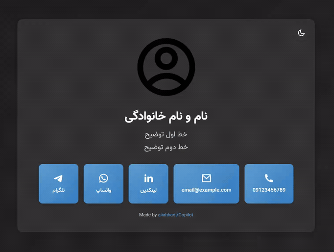

[🇬🇧 English](#english) | [🇮🇷 فارسی](#فارسی)

## English

### Live Demo
- URL: [https://aliashhadi.github.io/personal-profile-website/](https://aliashhadi.github.io/personal-profile-website/)
- Preview GIF:  
  [](https://aliashhadi.github.io/personal-profile-website/)

### What this app does
- Build a Persian-first, RTL single-page profile/link site with your rows, icons, colors, and font.
- Export single or batch outputs as static `index.html` + `style.css` folders; inline SVG icons and optional custom font are bundled.
- Batch import from `.xlsx` with a matching images folder; missing images are replaced with a placeholder and listed in `missing.txt`.

### Run locally
1) Install Python 3 (latest) for your OS.  
2) Open your system terminal and clone the repo:
   - macOS/Linux: `git clone https://github.com/AliAshhadi/personal-profile-website.git`
   - Windows (PowerShell): `git clone https://github.com/AliAshhadi/personal-profile-website.git`
3) Change into the project folder (use the full path on your machine):
   - macOS/Linux: `cd /path/to/personal-profile-website`
   - Windows (PowerShell): `cd C:\path\to\personal-profile-website`
4) First time setup:
    ```bash
    python -m venv venv
    source venv/bin/activate   # On Windows: venv\Scripts\activate
    pip install -r requirements.txt
    python -m app.app
    ```
5) Next time:
    ```bash
    source venv/bin/activate   # On Windows: venv\Scripts\activate
    python -m app.app
    ```
Open http://127.0.0.1:5000 and use the 3 tabs (Design, Data, Export). The icon library (built-in + your custom SVGs) is stored on disk for reuse.

This program was written with GitHub Copilot and ChatGPT Codex.

### Credits
- Template: aliashhadi/personal-profile-website
- Icons: [RemixIcon](https://remixicon.com/)
- Persian font: [Vazirmatn](https://rastikerdar.github.io/vazirmatn/)

---

## فارسی

### لینک زنده
- آدرس: [https://aliashhadi.github.io/personal-profile-website/](https://aliashhadi.github.io/personal-profile-website/)
- پیش‌نمایش GIF:  
  [](https://aliashhadi.github.io/personal-profile-website/)

### این اپ چه می‌سازد؟
- یک صفحه پروفایل/لینک RTL با ردیف‌های دلخواه، آیکن‌های SVG، رنگ‌ها و فونت سفارشی.
- خروجی تکی یا گروهی به صورت پوشه استاتیک `index.html` و `style.css`؛ آیکن‌ها و فونت سفارشی داخل خروجی قرار می‌گیرند.
- ورود فایل اکسل (`.xlsx`) در حالت گروهی + پوشه تصاویر؛ تصاویر گمشده با جایگزین پیش‌فرض و فایل `missing.txt` گزارش می‌شوند.

### اجرای محلی
1) پایتون ۳ را نصب کنید.  
2) در ترمینال سیستم خود دستور کلون را اجرا کنید:
   - macOS/Linux: `git clone https://github.com/AliAshhadi/personal-profile-website.git`
   - ویندوز (PowerShell): `git clone https://github.com/AliAshhadi/personal-profile-website.git`
3) وارد پوشه پروژه شوید (مسیر کامل روی سیستم خود را بنویسید):
   - macOS/Linux: `cd /path/to/personal-profile-website`
   - ویندوز (PowerShell): `cd C:\path\to\personal-profile-website`
4) بار اول:
    ```bash
    python -m venv venv
    source venv/bin/activate   # ویندوز: venv\Scripts\activate
    pip install -r requirements.txt
    python -m app.app
    ```
5) دفعات بعد:
    ```bash
    source venv/bin/activate   # ویندوز: venv\Scripts\activate
    python -m app.app
    ```
آدرس http://127.0.0.1:5000 را باز کنید. آیکن‌های پیش‌فرض و آیکن‌های سفارشی شما روی دیسک ذخیره می‌شوند تا بعداً هم در دسترس باشند.

این برنامه با GitHub Copilot و ChatGPT Codex نوشته شده است.

### اعتبارها
- قالب: aliashhadi/personal-profile-website
- آیکن‌ها: [RemixIcon](https://remixicon.com/)
- فونت فارسی: [Vazirmatn](https://rastikerdar.github.io/vazirmatn/)
